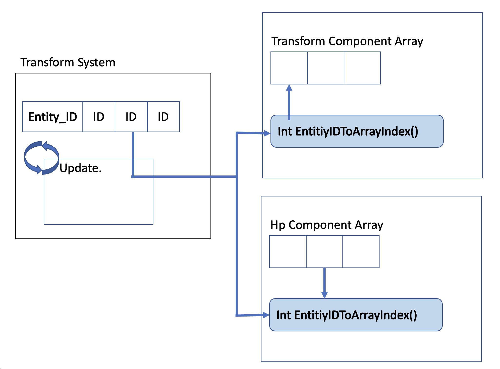

# Unity_ECS_Test

* 유니티의 ECS 아키텍쳐 게임을 제작하기 위한 프로젝트.

## ECS 간단한 설명. 

### 아키텍쳐.

ECS(Entitiy Component System) 는 기존의 Component-based 시스템과 다른 프로그래밍 아키텍쳐로

* Entity(Object ID) : Object Id 를 표현.
* Component(Data)   : 데이터.
* System(Logic)     : 행동을 구현 하는 곳.

위와 같은 구조를 가진다.  
Component-based system 는 속성, 데이터, 캡슐화를 잘 활용하기 위한 아키텍쳐이다.

### 동작 방식

프로그램이 실행되면 Entity, Component, System 에 대한 **Manager** 와 Codinator 생성이된다.!

1. EntityManager 는 Entity 들을 미리 생성해 배열에 저장, 관리 하며 마치 오브젝트 풀과 유사한 동작을 가지는 매니저.
2. ComponentManager 는 사용자가 정의한 각 Component 배열을 관리하며 사용자가 컴포넌트를 추가 삭제함에 따라 요소가 늘어나고 줄어든다.
3. SystemManager 는 업데이트 되어야할 entity 의 id 배열를 들고 있으며 
4. Codinator 는 Entity 에 Component 를 추가하기 위한 전역 Helper 로 추

기존과 다른 장점은 무엇일까.
장점은 logic 의 복잡도가 많이 내려간다.

간단하게 적어보면 모든 엔티티들은 하나의 배열(최대 사이즈가 정의된)에 보관 되어있으며 쿼리를 통해 원하는 엔티티들을 가지고 올 수 있다.

*EntityArray => [Query] => Entitys*

쿼리를 통해 얻은 엔티티들을 어떤 동작을 할지 구현하고
만약 다른 엔티티에 영향을 주는 동작이 있다면 "UpdateCommand" 라는 명칭을 가지는 직렬화 큐를 이용해 동작하게 한다.

