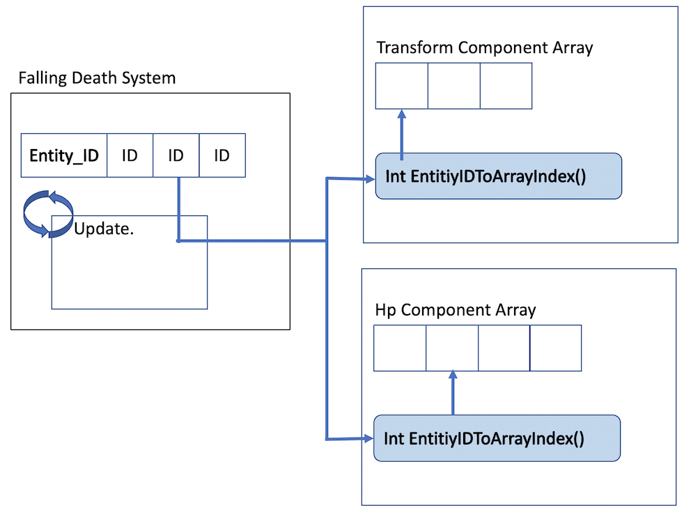

# Unity_ECS_Test

* 유니티의 ECS 아키텍쳐 게임을 제작하기 위한 프로젝트.

## ECS 간단한 설명. 

### 아키텍쳐.

ECS(Entitiy Component System) 는 기존의 Component-based 시스템과 다른 데이터 지향의 프로그래밍 아키텍쳐로

* Entity(Object ID) : ID.
* Component(Data)   : 데이터.
* System(Logic)     : 행동을 구현 하는 곳.

위와 같은 구조를 가진다.  
Component-based system 는 속성, 데이터, 캡슐화를 잘 활용하기 위한 아키텍쳐이다.

### 동작 방식



위 그림과 같은 방식으로 로직이 업데이트 될때 Entity ID 를 통해 Entity 에 엮여 있는 Component 를 찻고 로직을 업데이트한다.
만약 Entity 의 컴포넌트가 추가 또는 삭제가 된다면 System 에도 이를 알려 Entity 배열을 업데이트 되도록 한다.

자세한 구현은 아래를 참고.
[A SIMPLE ENTITY COMPONENT SYSTEM (ECS) [C++]](https://austinmorlan.com/posts/entity_component_system/).


### 장점

1. 상태와 로직이 분리 되어있어 복잡도를 낮출 수 있다.  
ex)  타겟의 체력을 깍는 기존 코드.  
```{.c++}
void Attack(Target& target_, int damage_) {
  target_.hp -= damage;
}
```
    
ecs 아키텍쳐의 코드 target 대한 정보가 필요없다.

```{.c++}
AttackSystem {
  Query.foreach (Entity id_, HpComponent hp_component_, int damage_) {
    hp_component_.hp -= damage_;
  }
}
```

2. 데이터 지향 프로그래밍 아키텍쳐로 인해 멀티쓰레드 효율이 좋아진다.
    
### 단점

1. Component-based System 에 비해 복잡도가 낮지만 또 다른 엔티티 의존성으로 인한 복잡도가 증가하는 것을 막을 수 없다.
2. 기존에 사용하던 게임 엔진의 기능들 애니메이션, 스킨 매쉬등등 이 ecs 를 지원하지 않기 때문에 제작이 매우 힘듬.
3. pure ecs 가 아닌 hybrid ecs 를 사용 했을때 game object 와 entity component 간 데이터를 주고받기가 힘들다.

## 후기.

아직 프리뷰이긴 하지만 기능이 많은 게임은 만들기 힘들어 보인다.
물론 코드의 복잡도가 낮아 진다고 하지만 상호 작용이 다양하고 많아질 경우 복잡도의 증가를 막을 수 없기 때문에 
복잡도의 장점도 많이 기대하기는 힘들 듯 하다. 
(오버워치는 프로그래머들이 기능을 만들고 기획자가 가져다 쓸수있는 도구를 제작해 가능했던 것으로 보인다.)
아직 게임에 ecs 아키텍쳐를 적용하는데는 시간이 필요해보인다.
